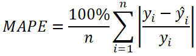

# Projeto de previsão de vendas Rossmann

Autor: Gabriel Cenciati 
Data: 28-03-2022

---

**Observação¹**: deixo aqui claro e explícito que o projeto é completamente fictício em todos os seus aspectos, e tem com inuito o meu aprendizado prático em ciência de dados. Os dados foram liberados de forma pública, tal como, gratuíta, e podem ser encontrados em: [Kaggle](https://www.kaggle.com/c/rossmann-store-sales);
 
**Observação²**: essa é a segunda versão desse meu projeto de previsão de vendas Rossmann, o projeto foi traduzido do inglês para o português, e teve melhorias significativas na lógica de programação, qualidade do código e uma melhor documentação do processo.

---

**Tabela de conteúdos:**
  1. Introdução
  2. Problema de negócio
  3. Premissas
  4. Estratégia de resolução do problema
  5. Insights
  6. Algoritmo aplicado
  7. Conclusões
  8. Referências e créditos

---

### 1. Introdução
O projeto refere-se a um projeto feito para uma das maiores redes farmacêuticas da Europa, a Rossmann, com sua sede em Hanôver, Alemanha e uma equipe composta por mais de 3.000 (três mil) farmácias espalhadas por todo o antigo continente.

---

### 2. Problema de negócio
#### 2.1. Contexto
O CFO da rede de drogarias em questão pretende fazer expressivas reformas em alguma das farmácias da empresa, dessa forma, foi pedido para que o time de dados construisse um projeto com a finalidade de prever com maior precisão possível o lucro das próximas seis semanas da empresa, para que só assim a equipe financeira possa dar o aval para o início das reformas.

#### 2.2. Declaração do problema
Prever a receita das próximas seis semanas de todas as lojas da rede.

#### 2.3. Métrica alvo
A métrica usada como alvo principal neste projeto foi o MAE, acrônimo para _Mean Absolute Error_ (erro médio absoluto) que ao lado de seu "irmão" próximo, MAPE, sigla para _Mean Absolute Percentage Error_ (porcentagem do erro absoluto médio) se torna muito mais informativa, enquanto que o MAE representa o valor absoluto do erro (podendo estar superestimado ou subestimado), o MAPE irá representar esse valor em forma de um percentual relativo ao erro da previsão, o que por sua vez facilitará (e muito) o completo entendimento dos resultados e da situação. Abaixo segue a fórmula em LateX de cada uma das métricas citadas.

---

### 3. Premissas
Aqui está listado o que assumi para prosseguir com a realização do projeto, visto que, é um projeto fictício, e logo, não tenho contato com a fonte geradora dos dados.

* **'assortment'**: o real tamanho de cada categoria NÃO foi especificado na página oficial de liberação dos dados, então segue o que foi assumido por mim:
  * a (basic) = menor variedade;
  * b (extra) = maior que 'basic' e menor que 'extended';
  * c (extended) = maior variedade.

---

### 4. Estratégia de resolução do problema
#### 4.1. CRISP-DM
A fim de obter valor o mais rápido possível para o negócio em questão, neste projeto foi adotado o CRISP-DM, acrônimo para _Cross Industry Standard Process for Data Mining_, que por sua vez é uma metodologia cíclica já comprovada pela indústria. O metódo consiste em fases não fixas que são frequentemente revisitadas, para que dessa forma, o projeto se torne não só mais flexível a mudanças (economizando tempo e dinheiro), mas também mais dinâmico (sujeito a constantes melhorias).

#### 4.2. Etapas
Foram esses os passos que segui para a realização deste projeto com a abordagem do CRISP-DM:

 0. Entendimento do problema de negócio **(Arquivo README do projeto)**
 1. Limpeza e descrição estatística dos dados
 2. Engenharia de features
 3. Análise exploratória de dados
 4. Pré-processamento de dados
 5. Seleção de features
 6. Modelagem de algoritmos de machine learning
 7. Tunagem fina de hiperparâmetros
 8. Deploy (implementação do projeto para uso prático)

---

### 5. Insights
**Observação³:** estes _insights_ não necessariamente implicam causa e consequência, e sim comportamentos encontrados nessa situação e conjunto de dados em específico. Contudo, de forma alguma devem ser negligenciados.
 

 

 

 

 

 

---

### 6. Algoritmo aplicado
#### 6.1. Algoritmo
O melhor desempenho foi apresentado pelo **LightGBM**, algorítmo baseado em árvores com a técnica de _gradient boosting_, que tem como uma de suas mais notáveis características, a velocidade, velocidade essa que afeta diretamente o custo de uso continuo do modelo em ambiente de produção, mas que nesse caso é razão de tranquilidade, pois, estamos falando de um modelo extremamente rápido, eficiente e pouco custoso.

#### 6.2. Performance
Resultando em um MAE de cerca de 632.8 para "baixo" ou para "cima" do valor final predito por nosso modelo, e que em porcentagem segundo o MAPE representaria aproximadamente 10% de erro em cada previsão feita pelo nosso algoritmo treinado e tunado, temos em mãos um resultado satisfatório para uma entrega de primeiro ciclo do CRISP-DM. Essa afirmação foi levando em consideração que segundo nossa situação fictícia, não havia nenhum modelo em vigor para sequer dar uma ideia da viabilidade das reformas propostas anteriormente pelo CFO da Rossmann. Portanto, reafirmo que dado as circunstâncias foi projetado um modelo rápido, eficaz e pouco custoso, que dentro de uma receita diária que gira em torno de €6.000/dia, temos sim um resultado dentro de uma ordem de grandeza aceitável, e por conseguinte, adequado para ser colocado em produção o quanto antes.

---

### 7. Conclusões
#### 7.1. Resultados
Antes das considerações finais, aqui vão algumas caracterísitcas e comportamentos do modelo.

* O gráfico abaixo denota em quais valores nosso modelo poderia estar tendo maiores dificuldades para prever. No entanto, como percebermos na distribuição dos pontos (cada ponto indica uma previsão), temos um modelo com erros bastante homogêneos (o que é bom), e como já vimos anteriormente esse erro é de aproximadamente 10%.
  

* O primeiro gráfico mostra como nossas previsões (laranja) se comportam com o passar do tempo em relação ao que realmente aconteceu (azul), percebe-se que nosso modelo anda sempre próximo com a realidade, sem muitas discrepâncias;
* O segundo gráfico na parte de cima, evidencia os espaços no tempo que nosso modelo teve os melhores e piores desempenhos, sendo que quanto mais próximo de 1 (um) mais fiel à realidade;
* O primeiro gráfico da parte inferior, é uma distribuição dos nossos erros "puros" (o que aconteceu - o que foi previsto), nele notamos que se trata de uma distribuição bem próxima da normal (gaussiana);
* O quarto e último gráfico, evidencia os intervalos de valores que o nosso modelo tem maior dificuldade de prever, quanto mais próximo do formato de um tubo a distribuição dos pontos, melhor, pois significaria que ele não tem grandes dificuldades em nenhum valor específico. Nosso modelo por sinal, tem uma distribuição bem semelhante a de um tubo.
  

* A tabela abaixo indica segundo as previsões do algoritmo qual seria o melhor e o pior cenário de vendas das próximas seis semanas, sendo € 278.920,20 o valor previsto pelo modelo, € 278.203,70 o valor equivalente ao pior cenário de vendas e por fim no melhor dos casos todas as farmácias teriam uma receita de € 279.636,69 em cerca de um mês e duas semanas.
  

Além disso, quero ressaltar uma integração com a API do aplicativo de mensagens Telegram que foi utilizada como meio de conectar o usuário final com os resultados do projeto, para que dessa forma, ele não só tenha acesso a tudo que foi desenvolvido aqui de maneira prática e fácil, mas também tenha isso com fácil acessibilidade (qualquer dispositivo que rode o Telegram), podendo ser em seu celular, tablet, notebook, desktop, etc. Segue abaixo uma demonstração simples do uso da ferramenta integrada, que consiste em mandar o número da loja, e logo em seguida receber o quanto é previsto que haja de receita nessa mesma loja nas próximas seis semanas.
  

Em suma, acredito que o projeto, a priori, foi bem sucedido, sendo capaz de fazer o que foi proposto desde o princípio, dar um argumento confiável, embasado em dados da praticabilidade ou não de um investimento em maior estrutura para as lojas da rede de farmácias Rossmann.

#### 7.2. Lições aprendidas no decorrer deste projeto
* Maior segurança na utilização da metodologia CRISP-DM;
* Primeiro contato com time series e suas peculiaridades dentro de um projeto de regressão;
* Transformei o meu maior algoz, a criação de gráficos em matplotlib e seaborn, em um grande amigo duradouro em potencial;
* Uso de dados serializados com finalidade de _checkpoints_ para melhor aproveitamento da memória do computador;
* Maior contato com a transferência de conteúdos oriundos de fontes diversas como: artigos, blogs, papers científicos, etc. para dentro do meu código;
* Entendimento do uso de artifícios matemáticos dentro da programação, e não da matemática propriamente dita.

#### 7.3. O que pode ser melhorado
* Na etapa de tratamento de _outliers_, testar técnicas menos matemáticas e mais guiadas ao pensamento de negócio;
* Se caso houver disponibilidade de máquina potente, testar criação de _features polinomiais_ para tentativa de melhor modelagem do fenômeno e avaliá-las com algoritmos de seleção de _features_;
* Criar maior variedade de hipótese e testá-las;
* Dar maior embasamento estatístico para cada hipótese (p-valor, etc.);
* Testar alguma técnica de transformação de distribuições para gaussiana, as chamadas _power transformations_ (box-cox, yeo johson, etc.).

---

### 8. Referências e créditos
[1] https://en.wikipedia.org/wiki/Rossmann_(company)

[2] https://www.rossmann.pl/firma/en-us/about-us/rossmann-in-a-nutshell

[3] https://www.ibm.com/docs/en/spss-modeler/SaaS?topic=dm-crisp-help-overview

[4] https://mineracaodedados.files.wordpress.com/2012/04/the-crisp-dm-model-the-new-blueprint-for-data-mining-shearer-colin.pdf

[5] BROWNLEE, Jason. Data Preparation for Machine Learning: Data Cleaning, Feature Selection, and Data Transforms in Python. 1. ed. 2020.